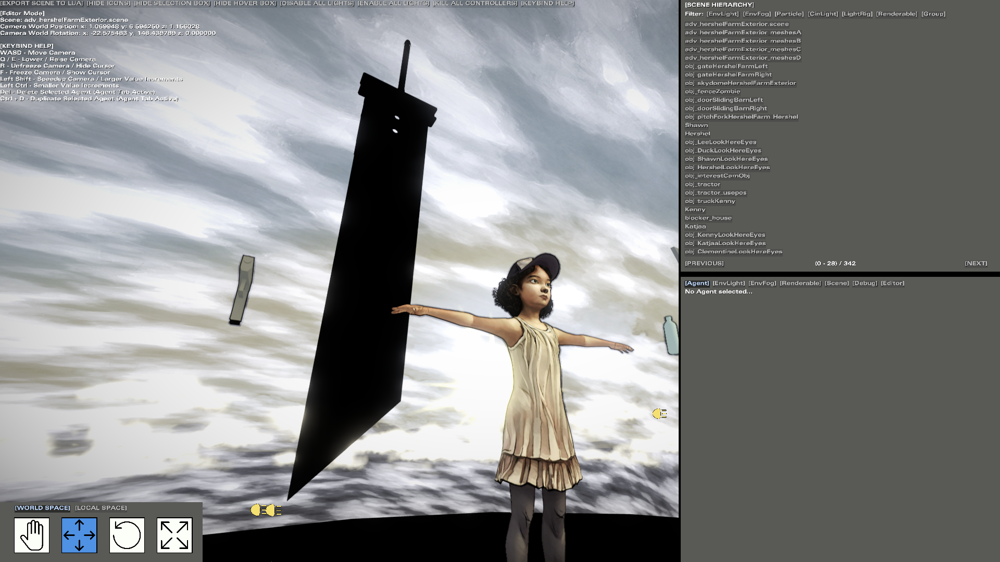

# D3DMESH Converter
This is an application designed for converting **.d3dmesh models (Telltale Tool Models)**, to a standard model format ***(.fbx, .dae, .gltf, .obj, and more)*** and back.

## DISCLAIMER (Please Read)
**This project is a heavy work in progress and is unfinished. The only working game this has been tested for is [The Walking Dead Telltale Definitive Series Edition](https://store.steampowered.com/app/1449690/The_Walking_Dead_The_Telltale_Definitive_Series/). Any other versions are most likely not going to work.**

## Description

This application is a standalone app for converting telltale's proprietary ***.d3dmesh*** format into standard model formats ***(.fbx, .dae, .gltf, .obj, and more)*** using the [Assimp library](https://github.com/assimp/assimp).

During conversions, an intermediate human readable ***.json*** text file is generated. This ***.json*** text file matches the original ***.d3dmesh / .skl*** binary structures 1:1. You can open a text editor, along with a hex editor and follow the binary structures/fields in order.

This ***.json*** intermediate text file is used during conversions as without it, much of the data would get lost. This is similar to the [Texture Tool Converter](https://github.com/Telltale-Modding-Group/Telltale-Texture-Tool) which makes doing conversions back to the original binary file format much easier.

In addition for converting ***.d3dmesh*** to a standard model format. There is also support for doing it in reverse. A standard model format ***(.fbx, .dae, .gltf, .obj, and more)*** back to a ***.d3dmesh*** file for mesh modding *(as shown below)*.

### TODO

- Construct a console or GUI interface for the app for ease of use.
- Extracting bones/skeletal rigging information from both the ***.d3dmesh*** and the coresponding ***.skl*** into an Assimp skeletal rig.
- Converting an Assimp skeletal rig to a coresponding ***.d3dmesh*** and ***.skl*** for skeletal mesh modding.
- Improve additional support for multiple d3dmesh vertex buffer types.
- Add/Removing Materials.
- Option for Automatic Shadow LOD Creation when converting a standard model format back to d3dmesh.

## Screenshots

*(Converted .d3dmesh to an .fbx file, previewing it in blender)*

*(NOTE: In-game screenshots of a modified test scene using the [Relight Editor](https://github.com/Telltale-Modding-Group/TTDS-Relighting) for previewing modified/new d3dmesh assets)*

*(NOTE: In-game screenshots of a modified test scene using the [Relight Editor](https://github.com/Telltale-Modding-Group/TTDS-Relighting) for previewing modified/new d3dmesh assets)*
<<<<<<< HEAD

*(NOTE: Created by [Arizzble](https://github.com/Arizzble). In-game screenshots of a modified mesh asset with coresponding modified textures via [Telltale Texture Tool](https://github.com/Telltale-Modding-Group/Telltale-Texture-Tool))*

*(NOTE: Created by [Arizzble](https://github.com/Arizzble). In-game screenshots of a modified mesh asset with coresponding modified textures via [Telltale Texture Tool](https://github.com/Telltale-Modding-Group/Telltale-Texture-Tool))*

*(NOTE: Created by [Arizzble](https://github.com/Arizzble). In-game screenshots of a modified mesh asset with coresponding modified textures via [Telltale Texture Tool](https://github.com/Telltale-Modding-Group/Telltale-Texture-Tool))*

*(NOTE: Created by [Arizzble](https://github.com/Arizzble). In-game screenshots of a modified mesh asset with coresponding modified textures via [Telltale Texture Tool](https://github.com/Telltale-Modding-Group/Telltale-Texture-Tool))*
=======
>>>>>>> d6034aa04866a7366cbb093beb0f2d12f14baa53
